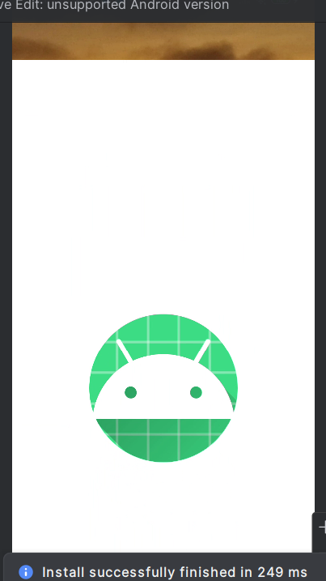
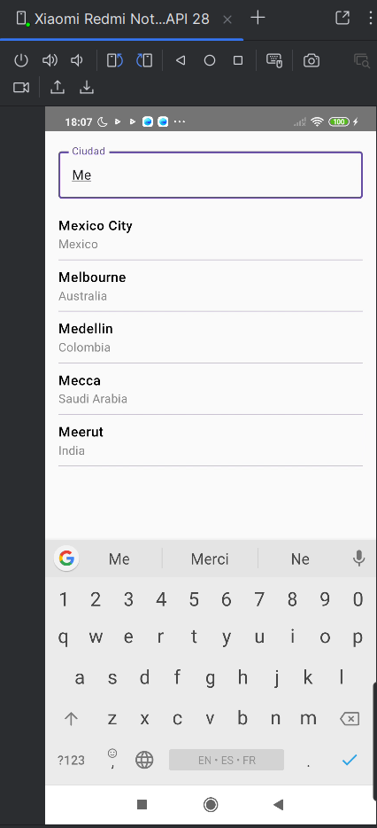
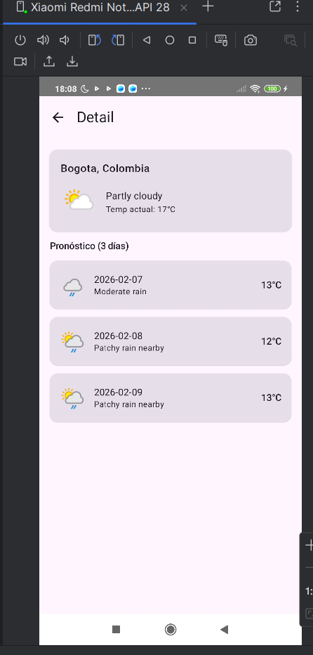
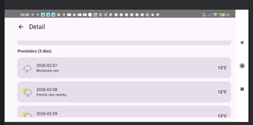

# WeatherApp

Aplicación Android (Kotlin + Jetpack Compose) que permite buscar ubicaciones y ver el pronóstico del clima usando **WeatherAPI**.

---

## Screenshots

> Las imágenes están en la carpeta `/screenshots` del repositorio.

| Splash | Búsqueda |
|---|---|
|  |  |

| Resultados | Detalle (3 días) |
|---|---|
|  |  |

---

## Funcionalidades

- Splash Screen
- Búsqueda de ubicaciones por texto
- Resultados actualizados a medida que se escribe
- Pantalla de detalle con:
    - Nombre de la ubicación y país
    - Clima actual (estado + temperatura)
    - Pronóstico de 3 días
- Manejo de estados: Loading / Success / Error
- Manejo de errores de red
- Soporte para rotación (portrait / landscape)

---

## Requisitos

- Android Studio (recomendado: Hedgehog o superior)
- Min SDK: **26**
- Conexión a internet
- API Key de WeatherAPI

---

## Configuración del API Key (obligatorio)

Documentación oficial de WeatherAPI:  
https://www.weatherapi.com/docs/

### Opción A (recomendada): `local.properties`

1. Clona el repo y abre el proyecto en Android Studio.
2. En la **raíz del proyecto**, crea/edita el archivo `local.properties` (al mismo nivel que `gradlew`).
3. Agrega esta línea:

   ```properties
   WEATHER_API_KEY=TU_API_KEY_AQUI
   
Nota: local.properties NO debe subirse al repositorio.

## Ejecutar la app

1. Verifica que ya configuraste WEATHER_API_KEY en local.properties.

2. Sync Gradle.

3. Ejecuta desde Android Studio con Run ▶ app en un emulador o dispositivo (API 26+).

## Testing
Hay pruebas unitarias enfocadas en ViewModels (coroutines + MockK/JUnit).

Para correrlas:

Android Studio: Click derecho sobre el paquete de tests → Run

O Gradle: ./gradlew test

## Uso de IA
Se utilizó Inteligencia Artificial (Chat GPT) como herramienta de apoyo para revisión de código, validación de buenas prácticas y mejoras puntuales (por ejemplo, ajustes de estados/UI y unit tests).
Las decisiones finales de implementación, arquitectura, librerias, integración y validación fueron realizadas por el desarrollador.

## Autor
Diego Nuñez

